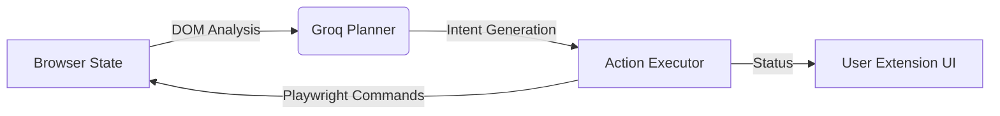

# 🌐 AUTOMATOR AI: The Autonomous Browser Agent

[](https://opensource.org/licenses/ISC)
[](https://groq.com)
[](https://playwright.dev)
[](https://render.com/deploy?repo=https://github.com/Jawknee-builds/browser_automator)

**AUTOMATOR AI** is a state-of-the-art autonomous browser agent designed to bridge the gap between AI reasoning and real-world web interaction. By combining **Groq’s ultra-fast LPU inference (Llama-3.3-70B)** with **Playwright’s industrial-grade automation**, it can "see," "think," and "act" on your behalf within any web application.

---

## 🚀 The Core Problem & Solution

### The Problem
Modern web workflows—from data scraping to CRM management—remain stubbornly manual. Traditional automation scripts are brittle and break when the DOM changes. Existing AI agents are often too slow to use "live."

### The Solution: Agentic Precision
AUTOMATOR AI uses a **perpetual feedback loop**. It captures the live state of the browser, sends it to a high-speed LLM planner, and executes precise actions in milliseconds. It doesn't just follow a script; it **navigates contextually.**

---

## 🛠️ Tech Stack

- **Reasoning Engine**: [Groq Cloud](https://groq.com) (Llama-3.3-70B/Llama-V3-Vision) - for millisecond latency.
- **Automation Core**: [Playwright](https://playwright.dev) - for robust, multi-browser control.
- **Backend**: [Node.js](https://nodejs.org) + [Express](https://expressjs.com) - for a lightweight orchestration layer.
- **UI/UX**: Chrome Extension (Sidepanel) - for seamless, in-context monitoring.

---

## 🏗️ Architecture Overview

The agent operates in a continuous **Observe -> Plan -> Execute** cycle:



1.  **Observe**: Grabs the DOM and window state from the active tab.
2.  **Plan**: Groq determines the next logical step (click, type, scroll, wait).
3.  **Execute**: Playwright carries out the action with high reliability.
4.  **Refine**: The agent re-observes and continues until the mission is "DONE."

---

## ⚡ Real-World Use Cases

| Workflow | Effort Saved | Description |
| :--- | :--- | :--- |
| **LinkedIn Prospecting** | 90% | Automatically visit profiles, extract lead data, and sync to a CRM. |
| **Amazon Price Tracking** | 100% | Monitor volatile pricing and trigger alerts/purchases when thresholds are met. |
| **SaaS Data Migration** | 80% | Move data from legacy web portals to modern platforms without APIs. |
| **Auto-Checkout** | 100% | Automate repetitive purchase flows for internal procurement or retail. |

---

## 📦 Quickstart

### 1. Prerequisites
- [Node.js](https://nodejs.org) (v18+)
- [Groq API Key](https://console.groq.com)

### 2. Installation
```bash
git clone https://github.com/Jawknee-builds/browser_automator.git
cd browser_automator
npm install
npx playwright install
```

### 3. Configuration
Rename `.env.example` to `.env` (or create it) and add your keys:
```env
GROQ_API_KEY=your_groq_key_here
PORT=3000
```

### 4. Running the Agent
```bash
npm start
```

### 5. Install the Chrome Extension
1. Open Chrome and go to `chrome://extensions/`.
2. Enable **Developer Mode** (top right).
3. Click **Load unpacked** and select the `extension/` folder in this project.
4. Open the **Sidepanel** to start automating!

---

## 🌩️ Production Deployment (Render)
If you want to run the server orchestrator permanently in the cloud for remote API triggers or continuous background task queues:

1. Click the **Deploy to Render** button above or sign in to the [Render Dashboard](https://dashboard.render.com).
2. Choose **Web Service** and deploy the `browser_automator` repository.
3. Configure the following environment variables:
   - `GROQ_API_KEY` = (Your active Groq Cloud Key)
   - `PORT` = `3001`
4. Click **Deploy**. Render will host your autonomous agent server for free.

---


## 🔮 Future Roadmap

- [ ] **Persistent Sessions**: Maintain cookies/profiles across multiple runs.
- [ ] **Multi-Agent Swarms**: Coordination between multiple browser instances for parallel tasks.
- [ ] **Vision-First Planning**: Full support for Llama-3-Vision to handle Canvas and SVG-heavy apps.
- [ ] **Human-in-the-Loop**: Pause for manual CAPTCHA or sensitive confirmations.

---

## 🤝 Contributing
Open Source devs are welcome! Please open an issue or submit a PR.

---

## 📄 License
Distributed under the **ISC License**. See `LICENSE` for more information.

---
*Built with ❤️ by [Jawknee-builds](https://github.com/Jawknee-builds)*
